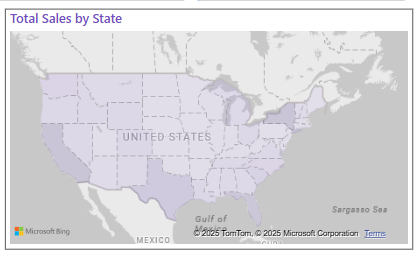

# AdiDash: The 3-Stripes Data Dive 🚀

Welcome to **AdiDash**, an interactive **Power BI** dashboard that transforms Adidas sales data into actionable insights. Explore trends in sales, profit margins, and product performance to make smarter decisions for inventory, pricing, and market expansion.

---

## 📌 Table of Contents
1. [Overview](#overview)  
2. [Problem Statement](#problem-statement)  
3. [Key Visuals & KPIs](#key-visuals--kpis)  
4. [Sample Dashboard Screenshots](#sample-dashboard-screenshots)  
5. [How to Use](#how-to-use)  
6. [Contact](#contact)  

---

## Overview
This project examines **Adidas US Sales** data using Power BI to:  
- Identify **peak sales periods**  
- Uncover **regional performance**  
- Evaluate **product demand**  
- Refine **pricing and margin** strategies  

---

## Problem Statement
Adidas needs a unified view of sales to pinpoint:  
- **When** sales spike (monthly/seasonal trends)  
- **Where** sales excel or lag (states/regions)  
- **Which** products and retailers drive revenue  
- **How** pricing and margins can be optimized  

---

## Key Visuals & KPIs
- **Sales by Month (Line Chart)**  
- **Total Sales by Region (Donut Chart)**  
- **Filled Map** for geographical sales  
- **KPI Cards** for total sales, profit, margin, and average price  
- **Slicers** for region and invoice date  

---

## Sample Dashboard Screenshots

1. **Overall Dashboard**  
   

2. **KPI Cards**  
   

3. **Sales by Month (Line Chart)**  
   

4. **Total Sales by Region (Donut Chart)**  
   

5. **Region Slicer**  
   

6. **Invoice Date Slicer**  
   

7. **Filled Map**  
   

8. **Filled Map Information**  
   

9. **Product and Retailer Breakdown**  
   

---

## How to Use
1. **Clone** this repository or **download** the files.  
2. Open `Adidas US Sales Datasets.xlsx` (if needed) and the `.pbix` file in **Power BI Desktop**.  
3. **Connect** the dataset or use the provided data.  
4. Interact with **filters and slicers** to customize your analysis.  

---
